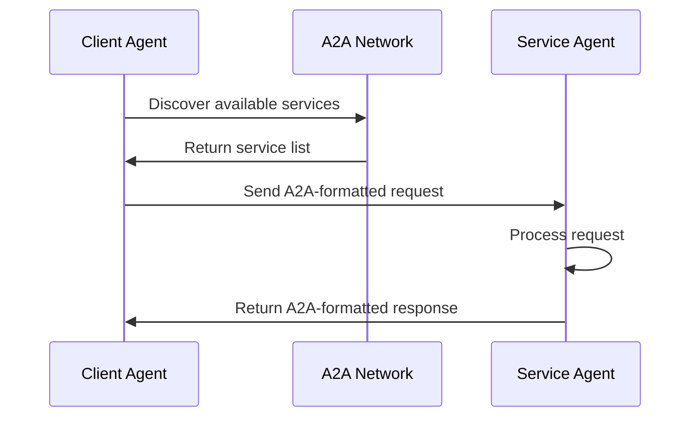

# A2A Protocol Documentation

The Agent-to-Agent (A2A) protocol is an open standard designed to enable seamless communication and collaboration between AI agents. This documentation provides comprehensive information about the A2A protocol, its design principles, and implementation details.

## 📖 Table of Contents

- [Protocol Overview](./overview.md)
- [Design Principles](./design-principles.md)
- [How A2A Works](./how-it-works.md)
- [Key Capabilities](./key-capabilities.md)
- [Technology Partners](./partners.md)

## 🎯 What is A2A?

The **Agent2Agent (A2A) Protocol** is an open standard designed to enable seamless communication and collaboration between AI agents. In a world where agents are built using diverse frameworks and by different vendors, A2A provides a common language, breaking down silos and fostering a more collaborative AI ecosystem.

### Core Mission

A2A aims to create a standardized way for AI agents to communicate, share information, and work together regardless of their underlying technology or provider. This enables:

- **Interoperability** between different agent platforms
- **Composability** of agent capabilities
- **Scalability** of AI solutions
- **Innovation** through agent collaboration

## 🌟 Key Benefits

### For Developers
- **Simplified Integration** - Standard protocols reduce integration complexity
- **Reusable Components** - Build agents that work with any A2A-compatible system
- **Faster Development** - Leverage existing agent capabilities
- **Better Testing** - Standardized testing frameworks and tools

### For Organizations
- **Vendor Flexibility** - Choose the best agents for each use case
- **Cost Efficiency** - Avoid vendor lock-in and reduce development costs
- **Future-Proofing** - Build on open standards that evolve with the industry
- **Competitive Advantage** - Access to a broader ecosystem of AI capabilities

### For the AI Ecosystem
- **Collaboration** - Agents can work together across organizational boundaries
- **Innovation** - New use cases emerge from agent combinations
- **Standards** - Common protocols drive industry-wide adoption
- **Transparency** - Open standards promote understanding and trust

## 🔧 How It Works

### Basic Architecture

A2A operates on a simple but powerful principle: **standardized message formats** and **well-defined interfaces**. Here's how it works:

1. **Agent Registration** - Agents register their capabilities with the A2A network
2. **Service Discovery** - Agents can discover other agents and their capabilities
3. **Message Exchange** - Agents communicate using standardized A2A message formats
4. **Task Execution** - Agents can delegate tasks to other agents
5. **Result Aggregation** - Results are collected and returned to the original requester

### Message Flow



## 🏗️ Technical Foundation

### Core Components

1. **A2A Message Format** - Standardized JSON schema for agent communication
2. **Service Registry** - Centralized directory of available agents and capabilities
3. **Protocol Handlers** - Libraries for implementing A2A in different languages
4. **Security Framework** - Authentication, authorization, and encryption standards
5. **Monitoring & Observability** - Tools for tracking agent interactions

### Supported Languages & Frameworks

- **Python** - Official SDK with full A2A support
- **JavaScript/Node.js** - Complete implementation for web applications
- **Java** - Enterprise-grade A2A implementation
- **Go** - High-performance A2A library
- **Rust** - Memory-safe A2A implementation
- **C#/.NET** - Microsoft ecosystem integration

## 🔒 Security & Privacy

### Authentication & Authorization

A2A supports multiple authentication mechanisms:

- **API Keys** - Simple authentication for development and testing
- **OAuth 2.0** - Standard OAuth flows for production applications
- **JWT Tokens** - Stateless authentication with custom claims
- **Certificate-based** - PKI-based authentication for high-security environments

### Data Protection

- **End-to-End Encryption** - All messages are encrypted in transit
- **Data Minimization** - Only necessary data is shared between agents
- **Audit Logging** - Comprehensive logging for compliance and debugging
- **Privacy Controls** - Granular control over data sharing and retention

## 🚀 Getting Started

### Quick Start Guide

1. **Choose Your Language** - Select from our supported SDKs
2. **Install the SDK** - Add the A2A library to your project
3. **Register Your Agent** - Define your agent's capabilities
4. **Start Communicating** - Begin exchanging messages with other agents

### Example: Simple Agent

```python
from a2a import Agent, Task, Response

class MyFirstAgent(Agent):
    async def process_task(self, task: Task) -> Response:
        # Your agent logic here
        result = f"Processed: {task.input}"
        return Response(content=result, status="completed")

# Register and start your agent
agent = MyFirstAgent()
agent.start()
```

## 📊 Current Status

### Protocol Version
- **Current Version**: 1.0.0
- **Status**: Stable and production-ready
- **Backward Compatibility**: Full support for v0.x implementations

### Adoption
- **Active Agents**: 1,000+ registered agents
- **Organizations**: 50+ companies using A2A
- **Use Cases**: 100+ different application scenarios
- **Community**: 5,000+ developers contributing

### Roadmap
- **Q2 2024**: Enhanced security features
- **Q3 2024**: Advanced routing and load balancing
- **Q4 2024**: Machine learning optimization
- **Q1 2025**: Enterprise governance features

## 🤝 Contributing

### How to Contribute

1. **Join the Community** - Participate in discussions and forums
2. **Report Issues** - Help identify bugs and suggest improvements
3. **Submit Proposals** - Propose new features and enhancements
4. **Write Documentation** - Improve guides and examples
5. **Build Agents** - Create and share A2A-compatible agents

### Development Process

- **RFC Process** - Formal review for major changes
- **Code Review** - All contributions reviewed by maintainers
- **Testing** - Comprehensive test suite for all changes
- **Documentation** - Updated documentation for all features

## 📚 Resources

### Official Documentation
- [Protocol Specification](https://google-a2a.github.io/A2A/latest/)
- [API Reference](https://google-a2a.github.io/A2A/api/)
- [Best Practices](https://google-a2a.github.io/A2A/best-practices/)

### Community Resources
- [GitHub Repository](https://github.com/google-a2a/A2A)
- [Discord Server](https://discord.gg/a2a-protocol)
- [Blog](https://a2a-protocol.dev/blog)
- [YouTube Channel](https://youtube.com/@a2a-protocol)

### Support
- [FAQ](https://google-a2a.github.io/A2A/faq/)
- [Community Forum](https://community.a2a-protocol.dev)
- [Enterprise Support](https://a2a-protocol.dev/enterprise)

## 🔗 Related Projects

- **A2A Catalog** - Discover and integrate A2A agents
- **A2A Hub** - Centralized agent management platform
- **A2A Studio** - Visual agent development environment
- **A2A Analytics** - Monitor and optimize agent performance

---

*The A2A protocol is developed and maintained by the A2A community, with support from Google and other technology partners. Join us in building the future of AI agent collaboration!* 